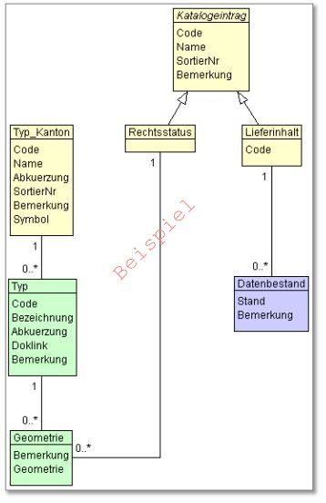

== Diagramme
Dieses Thema weist zwei Datenmodelle auf:

* ein Modell zur Datennachführung (Nachführungsmodell) und
* ein Modell zur Datenpublikation (Publikationsmodell).

Die Datenpflege erfolgt gemäss dem *Nachführungsmodell.* Anhand dieses Modells werden neue Schutzwälder eingefügt und bestehende verändert oder gelöscht. Aufgrund der Lage eines Schutzwaldes können weitere Merkmale bestimmt werden. Diese sind z.B. der Forstkreis und das Frostrevier, in welchem der Schutzwald liegt. Diese abgeleiteten Informationen werden bei der Datenpublikation berechnet und dem Datensatz hinzugefügt. Sie sind Bestandteil des *Publikationsmodells,* welches einen gegenüber dem Nachführungsmodell erweiterten Attributumfang aufweist.

=== Nachführungsmodell: Komponentendiagramm
image::../img/Komponentendiagramm.jpg[]

=== Nachführungsmodell: Klassendiagramm

=== Publikationsmodell: Komponentendiagramm
image::../img/Komponentendiagramm.jpg[]

=== Publikationsmodell: Klassendiagramm

ifdef::backend-pdf[]
<<<
endif::[]
