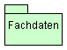
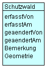
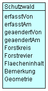

== Diagramme
Dieses Thema weist zwei Datenmodelle auf:

* ein Modell zur Datenbearbeitung (*Bearbeitungsmodell*) und
* ein Modell zur Datenpublikation (*Publikationsmodell intern*).

Die Datennachführung erfolgt gemäss dem *Bearbeitungsmodell.* Anhand dieses Modells werden neue Schutzwälder eingefügt und bestehende verändert oder gelöscht. Aufgrund der Lage eines Schutzwaldes können weitere Merkmale bestimmt werden. Diese sind z.B. der Forstkreis oder das Frostrevier, in welchem der Schutzwald liegt. Diese abgeleiteten Informationen werden bei der Datenpublikation berechnet und dem Datensatz hinzugefügt. Sie sind Bestandteil des *verwaltungsinternen Publikationsmodells,* welches einen gegenüber dem Bearbeitungsmodell erweiterten Attributumfang aufweist. Das verwaltungsinterne Publikationsmodell weist Attribute auf, die im öffentlichen Datensatz entfernt werden (z.B. die Angaben der Person, welche den Datensatz erfasst hat).

=== Komponentendiagramm (beide Modelle)

=== Bearbeitungsmodell: Klassendiagramm

=== Publikationsmodell: Klassendiagramm

ifdef::backend-pdf[]
<<<
endif::[]
